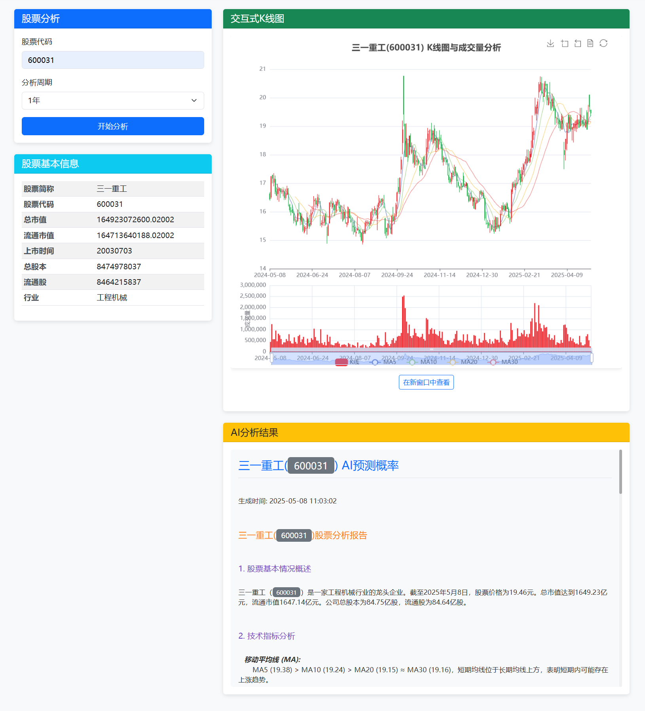
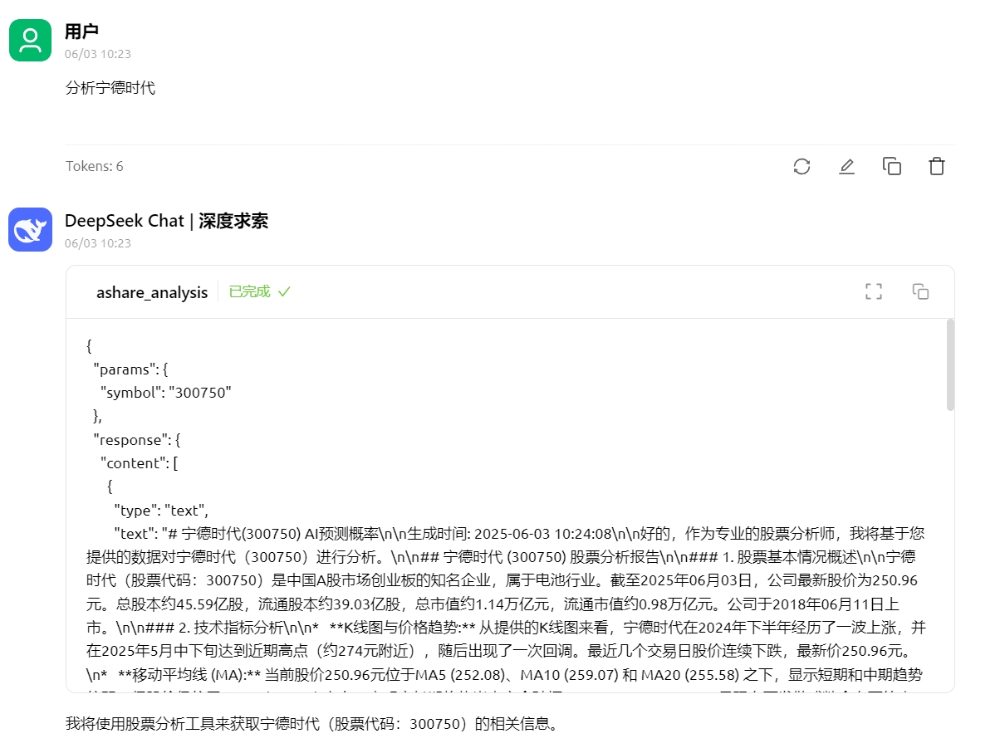
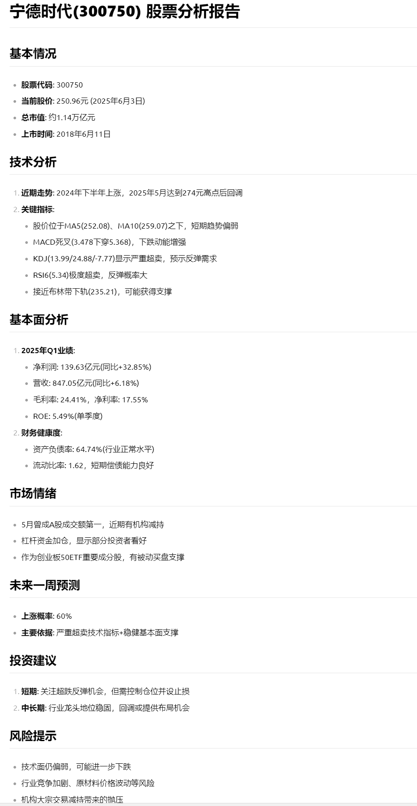

# AI看线 - 股票技术分析与AI预测工具（AI-Kline - Stock Technical Analysis and AI Prediction Tool）


<div align="center">
  <!-- Keep these links. Translations will automatically update with the README. -->
  <a href="README_EN.md">English</a> |  <a href="README.md">中文</a> 

</div>

## 项目简介

AI看线是一个基于Python的A股分析工具，结合了传统技术分析和人工智能预测功能。利用K线图，技术指标，财务数据，新闻数据对股票进行全面分析及预测。该工具可以：

1. 获取A股股票的历史量价数据并计算各种技术指标
2. 生成专业的K线图和技术指标可视化图表
3. 获取股票相关的财务数据和新闻信息
4. 使用openai api分析整合数据并预测股票未来走势

## 功能特点

- **数据获取**：使用AKShare获取A股股票的历史交易数据、财务数据和新闻信息
- **技术分析**：计算多种技术指标，包括MA、MACD、KDJ、RSI、布林带等
- **可视化**：生成静态和交互式K线图及技术指标图表
- **AI分析**：利用多模态AI分析股票数据并预测未来走势
- **Web界面**：提供简洁美观的Web界面，方便用户输入股票代码查看分析结果
- **MCP SERVER**：提供MCP SERVER支持，支持通过LLM交互，随时分析股票


## 安装说明

### 环境要求

- Python 3.8+
- 依赖包：见`requirements.txt`

### 安装步骤

1. 克隆或下载本项目到本地

2. 安装依赖包

```bash
pip install -r requirements.txt
```

3. 创建`.env`文件，添加API密钥

```
API_KEY=your_api_key_here
BASE_URL=https://dashscope.aliyuncs.com/compatible-mode/v1
MODEL_NAME=qwen-vl-max
```

> 注意：需使用多模态模型

## 使用方法

### 命令行使用

```bash
python main.py --stock_code 000001 --period 1年 --save_path ./output
```

参数说明：
- `--stock_code`：股票代码，必填参数
- `--period`：分析周期，可选值："1年"、"6个月"、"3个月"、"1个月"，默认为"1年"
- `--save_path`：结果保存路径，默认为"./output"

### Web界面使用

启动Web服务：

```bash
python web_app.py
```

然后在浏览器中访问 http://localhost:5000 即可使用Web界面：

1. 在表单中输入股票代码（例如：000001）
2. 选择分析周期
3. 点击"开始分析"按钮
4. 等待分析完成后查看结果

Web界面包括以下内容：
- 股票基本信息
- K线图和技术指标图表
- AI分析结果文本

页面截图：




### MCP SERVER使用

启动mcp：
```bash
uv run  mcp_server.py
```

然后在mcp客户端中配置（streamable-http）：
http://localhost:8000/mcp 

Cherry-Studio页面截图：





### 输出结果

程序运行后将在指定的保存路径下生成：

1. K线图和技术指标图表（静态PNG图片和交互式HTML图表）
2. AI分析结果文本文件


## 项目结构

```
AI看线/
├── main.py                 # 主程序入口
├── web_app.py              # Web应用入口
├── requirements.txt        # 依赖包列表
├── .env                    # 环境变量配置（需自行创建）
├── modules/                # 功能模块
│   ├── __init__.py
│   ├── data_fetcher.py     # 数据获取模块
│   ├── technical_analyzer.py # 技术分析模块
│   ├── visualizer.py       # 可视化模块
│   └── ai_analyzer.py      # AI分析模块
├── templates/              # Web模板目录
│   └── index.html          # 主页模板
├── static/                 # 静态资源目录
│   ├── css/                # CSS样式
│   │   └── style.css       # 自定义样式
│   └── js/                 # JavaScript脚本
│       └── main.js         # 主要脚本
└── output/                 # 输出结果目录（运行时自动创建）
    ├── charts/             # 图表目录
    └── *_analysis_result.txt # 分析结果文件
```


## 交流学习


## 注意事项

- 本工具仅供学习和研究使用，不构成任何投资建议
- AI分析结果基于历史数据和当前信息，不能保证未来走势的准确性
- 使用前请确保已正确配置Gemini API密钥
- 股票数据获取依赖于AKShare库，可能受到网络和数据源的限制
- 本项目为QuantML开源项目，转载或使用需注明出处，商业使用请联系微信号QuantML


## 免责声明

本工具提供的分析和预测仅供参考，不构成任何投资建议。投资有风险，入市需谨慎。用户应对自己的投资决策负责。